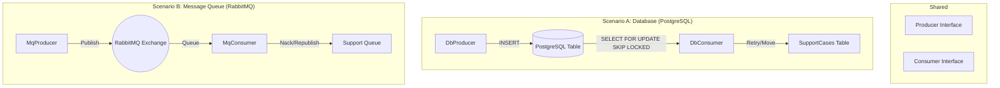
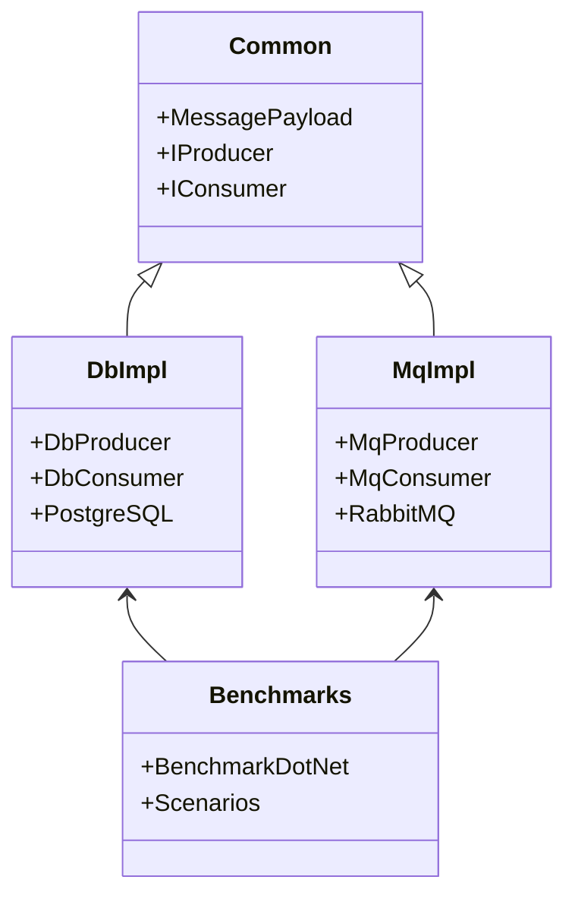

# Performance POC: PostgreSQL vs RabbitMQ


[](https://github.com/csa7mdm/performance-poc/actions/workflows/ci.yml)


This project is a Proof of Concept (POC) designed to benchmark and compare the performance of using **PostgreSQL** (as a queue via a table) versus **RabbitMQ** (a native message broker) for high-throughput producer-consumer workloads.

## 🎯 Purpose

The goal is to measure the trade-offs between a Database-as-a-Queue approach and a dedicated Message Broker. Key metrics measured include:
- **Throughput**: Messages processed per second.
- **Latency**: Time taken to publish and consume messages.
- **Scalability**: Performance under parallel load.

## 🏗️ Architecture

The solution consists of two parallel implementations sharing a common interface.

### High-Level Flow



### Project Structure



## 🚀 How to Run

### Prerequisites
- **Docker** (Desktop or Engine)
- **.NET 9.0 SDK**

### Steps

1.  **Start Infrastructure**
    ```bash
    docker compose up -d
    ```

2.  **Run Functional Verification**
    Verifies that retries and support queue logic work correctly.
    ```bash
    dotnet run -c Release --project PerformancePoc.Benchmarks -- test
    ```

3.  **Run Performance Benchmarks**
    Executes the BenchmarkDotNet suite.
    ```bash
    dotnet run -c Release --project PerformancePoc.Benchmarks
    ```

## 📊 Results Summary

The following results were obtained on an Apple M3 Pro (100 messages, 1KB payload).

| Operation | Scenario | PostgreSQL (Mean) | RabbitMQ (Mean) | Improvement |
| :--- | :--- | :--- | :--- | :--- |
| **Produce** | Sequential | **30.41 ms** | **0.28 ms** | **~108x Faster** |
| **Consume** | Sequential | **95.00 ms*** | **9.60 ms*** | **~10x Faster** |
| **Produce** | Parallel | **12.70 ms** | **0.41 ms** | **~30x Faster** |
| **Consume** | Parallel | **51.42 ms*** | **10.18 ms*** | **~5x Faster** |

*\*Note: Consume benchmarks include the time to pre-fill the queue.*

### Performance Visualization

```mermaid
gantt
    title Sequential Processing Time (Lower is Better)
    dateFormat X
    axisFormat %s
    
    section Produce (100 msgs)
    PostgreSQL : 0, 30
    RabbitMQ   : 0, 0.3
    
    section Consume (100 msgs)
    PostgreSQL : 0, 95
    RabbitMQ   : 0, 9.6
```



## 💡 Benefits & Conclusion

### RabbitMQ (Recommended for Queues)
- **Extreme Performance**: Orders of magnitude faster for publishing.
- **Low Latency**: Designed for real-time messaging.
- **Decoupling**: Native support for exchanges, routing, and complex patterns.

### PostgreSQL (Use with Caution)
- **Simplicity**: No extra infrastructure if you already have a DB.
- **Transactional Consistency**: Can update business data and queue message in the same transaction.
- **Performance Cost**: Heavy overhead due to locking (`SKIP LOCKED`) and transaction logs (WAL).

**Verdict**: Use **RabbitMQ** for any workload requiring high throughput or low latency. Use **PostgreSQL** only for low-volume, transactional internal jobs.

---

## 🤖 Built with Next-Gen AI

> "**The future of coding is agentic.**"

This project was architected, implemented, and benchmarked using **Google DeepMind's Antigravity IDE**, powered by the **Gemini 3** model.


### Technology Showcase
This repository serves as a demonstration of **Agentic AI capabilities** in software engineering:
*   **Autonomous Architecture**: From `docker-compose` topology to .NET solution structure.
*   **Self-Correction**: Automatically debugging CI/CD pipeline failures and resolving obscure .NET 9 nullability warnings.
*   **Performance Engineering**: Designing and executing `BenchmarkDotNet` suites to validate hypotheses.

_Created by [Ahmed Mustafa/csa7mdm] with the assistance of Antigravity._

